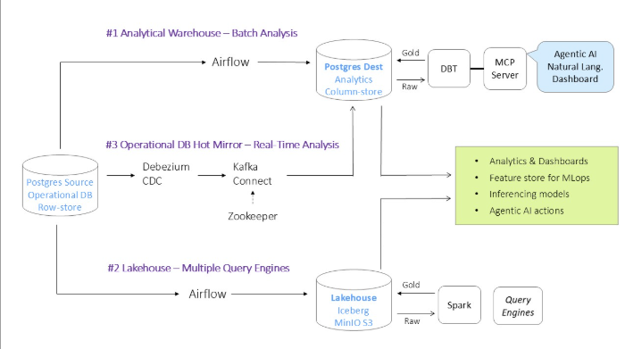

# Modern ETL Infrastructure

A comprehensive ETL stack demonstrating the integration of open-source data engineering tools. This project features both **real-time CDC (Change Data Capture)** via Kafka/Debezium and **high-scale batch processing** pipelines orchestrating data movement between a staging relational database, a data lake, and a destination database.

## Architecture

The system utilizes a **Definitive "Three-Track" Architecture**. This design separates highspeed operational mirrors, business-critical analytics, and massive historical archives into independent, parallel tracks.



### The Dual-Engine & Streaming Strategy

1. **#1 Analytical Warehouse (Batch Analysis):** Managed by **Airflow** and **dbt**. Staged data is loaded into the destination warehouse (`postgres-dest`). **dbt** applies modular SQL transforms to structure the raw data into integrated and presentation schemas. Integrating the **dbt MCP Server** exposes compiled queries and metadata to Agentic AI assistants for natural-language dashboard querying.
2. **#2 Lakehouse (Multiple Query Engines):** Managed by **Airflow** and **Spark**. Airflow orchestrates delta loads of parquet logs to **MinIO S3** (Bronze layer). **Apache Spark** transforms raw files into **Apache Iceberg** tables (Silver/Gold catalog) to allow high-scale historical data analysis and time-travel querying across multiple query engines.
3. **#3 Operational DB Hot Mirror (Real-Time Analysis):** Captured in real-time by **Debezium CDC** and streamed through **Kafka Connect** (coordinated by **Zookeeper**) directly into the target database. This offers a sub-second, transactional row-store mirror of the source database changes for live downstream event-driven microservices.

## Database Schema Structure

The Destination Data Warehouse (`destdb`) is strictly organized to ensure data quality and clear governance:
- **`raw` Schema:** Receives raw, messy data directly from the source system. Tables strictly follow the `_source` suffix (e.g., `raw.orders_source`).
- **`int` Schema:** The integration layer where data is cleaned, filtered, and deduplicated. Tables strictly follow the `_clean` suffix (e.g., `int.orders_clean`).
- **`prs` Schema:** The presentation layer exposing final, aggregated business views (e.g., `prs.v_daily_revenue`). Only this schema is exposed to BI tools.

## Technology Stack

| Layer | Component |
|---|---|
| **Orchestration** | Apache Airflow 2.8 |
| **CDC / Streaming** | Debezium 2.5 & Confluent Kafka 7.5 |
| **Object Storage** | MinIO (S3-compatible) |
| **Transformation** | dbt-core 1.7 (Incremental Models) |
| **Batch Compute** | Apache Spark 3.5 & Apache Iceberg 1.4 |
| **Data Warehouse** | PostgreSQL 15 |
| **BI / Dashboards** | Metabase |

## Quick Start

```bash
# 1. Clone repository and initialize environment variables
cp .env.example .env 

# 2. Spin up containers
make up

# 3. Wait ~60 seconds for services to reach healthy state, then seed database
make seed

# 4. Register the Debezium CDC connector
make register-connector
```

## Service Access URLs

| Service | Local URL | Credentials (Default) |
|---|---|---|
| **Airflow UI** | http://localhost:8080 | admin / admin |
| **MinIO Console** | http://localhost:9001 | minioadmin / minioadmin |
| **Kafka UI** | http://localhost:8001 | — |
| **Metabase** | http://localhost:3030 | (Setup Required) |
| **Spark Master** | http://localhost:8081 | — |
| **Kafka Connect** | http://localhost:8083 | — |

## Data Pipelines

### Airflow DAGs

1. **`ingest_source_to_bronze`** *(The Ingestion Engine)*
   - Parallel flow: Simultaneously extracts data to **MinIO Bronze** (for the Lakehouse) and **Postgres `raw`** (for the Warehouse).
   - Once ingestion is complete, it directly triggers the `dbt_transformations` task group.
2. **`dbt_transformations`** *(The Transformation Engine)*
   - Automatically cleans raw data into the `int` schema, and builds presentation views in the `prs` schema.
3. **`spark_transform_silver`** *(The Lakehouse Engine)*
   - High-scale Spark jobs that process raw Parquet files from Bronze into **Apache Iceberg** tables.

### dbt Modeling Structure

```text
dbt/models/
├── int/
│   ├── customers_clean.sql
│   ├── order_items_clean.sql
│   ├── orders_clean.sql
│   └── products_clean.sql
└── prs/
    ├── v_customers.sql
    ├── v_daily_revenue.sql
    ├── v_orders.sql
    └── v_products.sql
```

## Project Operations

```bash
make up                  # Start infrastructure
make down                # Tear down infrastructure
make logs                # Tail aggregated container logs
make ps                  # Service health check
make seed                # Generate sample source data
make register-connector  # Initialize Debezium CDC connector
```
