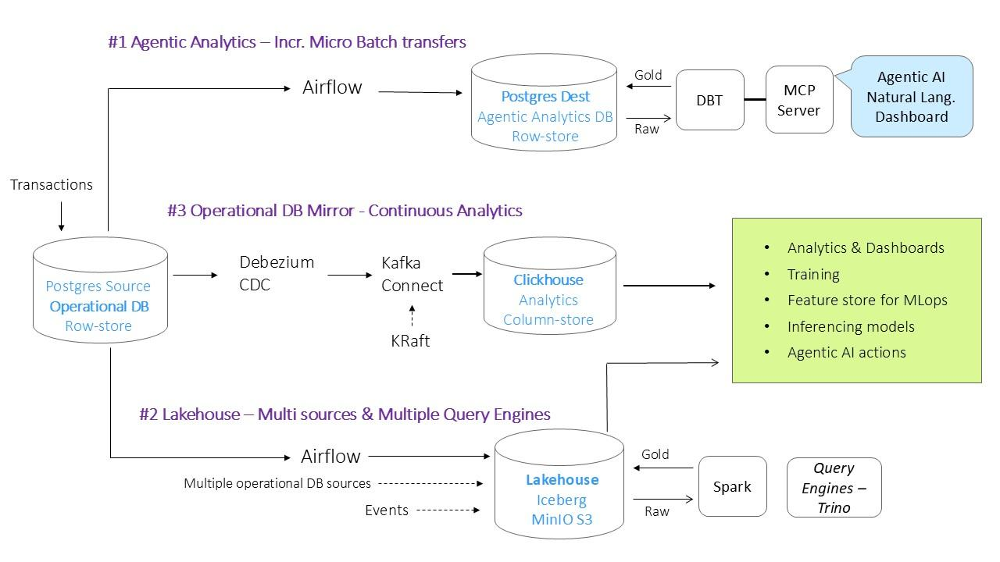

# Modern ETL Infrastructure

A comprehensive ETL stack demonstrating the integration of open-source data engineering tools. One operational source database feeds **three independent, parallel pipelines**: a real-time CDC mirror, a batch analytical warehouse, and an Iceberg lakehouse — topped with an AI data assistant that answers natural-language questions against all of them.

## Architecture



📄 The full design rationale is in the accompanying paper: [Data to Analytics Pipeline — Proof of Concept](https://github.com/kalluripradeep/modern-etl-stack/raw/main/docs/Data-to-Analytics-Pipeline-POC.pdf) (downloads the PDF)

```
                         ┌──► PIPE 3 · Real-Time Analytics (seconds)
                         │     WAL → Debezium → Kafka → ClickHouse mirror.* (column store)
                         │
 postgres-source ────────┼──► PIPE 1 · Analytical Warehouse (batch)
  (operational DB,       │     Airflow ingest → postgres-dest raw.* → dbt → int.* → prs.v_*
   transactions)         │                   └─► MinIO bronze/ (parquet)
                         │                              │
                         └──────────────────────────────┴──► PIPE 2 · Lakehouse (batch, big data)
                                                             Spark → Iceberg tables (silver, MinIO)
                                                             queried via Trino
```

One destination per pipeline, each matched to an access pattern: the source Postgres stays the transactional system of record; Pipe 1 delivers tested batch marts in Postgres; Pipe 2 delivers big historical data in Iceberg via Trino; Pipe 3 delivers real-time analytics in ClickHouse.

All three pipelines run in parallel from the same source. Pipes 1 and 3 are fully independent; Pipe 2 consumes the bronze parquet produced by Pipe 1's ingestion DAG.

## Data Pipelines

### 1. Analytical Warehouse — Batch Analysis
Airflow extracts snapshots from the operational database in chunked micro-batches, lands them in the `raw` schema of the destination warehouse, and dbt transforms them into cleaned (`int`) and presentation (`prs`) layers. Best for business reporting, BI tools, and any workload where daily freshness is enough. Simple to deploy and debug, minimal infrastructure.

### 2. Lakehouse — Big Historical Data, Many Query Engines
The same ingestion run writes parquet files to MinIO (bronze). Spark jobs clean and MERGE them into **Apache Iceberg** tables (silver), and **Trino** exposes those tables over ANSI SQL (`iceberg.lake.*`) to BI tools, notebooks, and the AI assistant. The Iceberg catalog is a JDBC catalog stored in the destination Postgres, so Spark and Trino always see the same tables. On Kubernetes, Trino is deployed via the official Helm chart (coordinator plus workers — scale with `server.workers` in `k8s/trino/helm-values.yaml`). Designed for data volumes that would be too expensive to keep in an operational database.

### 3. Real-Time Analytics — Streaming CDC into ClickHouse
Debezium captures every insert/update/delete from the source WAL into Kafka, and **ClickHouse** consumes the topics with its built-in Kafka engine, materializing them into columnar tables (query the `mirror.*_current` views). Seconds-level freshness for live dashboards and operational monitoring, without touching the source database's performance. Kafka in the middle buys durability and replay — the mirror can be rebuilt from the retained log — and lets future consumers subscribe to the same change stream without adding replication slots on the source.

### AI Data Assistant
A Next.js dashboard with an agentic analyst: it introspects the schemas of all three stores, decides which engine fits the question (warehouse, lakehouse via Trino, or the ClickHouse mirror), runs read-only SQL with automatic error-retry, and answers in plain language. Runs in demo mode without an API key; add an Anthropic API key to enable it, and set `DASHBOARD_AUTH_PASSWORD` to require a login.

## Adding a Source Table

Tables are defined once in [`airflow/dags/config/pipelines.yml`](airflow/dags/config/pipelines.yml) — the single source of truth. The ingestion DAG reads it directly; the ClickHouse mirror schema and Debezium connector are generated from it:

```bash
# 1. Add the table to airflow/dags/config/pipelines.yml
# 2. Regenerate the derived artifacts
make generate
```

CI fails if the generated files drift from the manifest, so they can never silently diverge.

### Bringing your own source tables

To point the platform at tables from an existing Postgres, add a block per table to the manifest (primary key, columns with their Postgres types, and the columns an upsert overwrites), then `make generate`. Two things to know:

- **Supported column types.** The generator maps `BIGINT`, `INTEGER`, `SMALLINT`, `BOOLEAN`, `REAL`, `DOUBLE PRECISION`, `NUMERIC(p,s)`, `DATE`, `TIMESTAMP`, `TEXT`, `VARCHAR`, `CHAR`, `UUID`, `JSON`, and `JSONB` to ClickHouse. `UUID`/`JSON`/`JSONB` are stored as `String` in the mirror; `NUMERIC` becomes an exact `Decimal`. An unlisted type fails fast at manifest load — add it to `_PG_TO_CLICKHOUSE` in [`pipeline_config.py`](airflow/dags/pipeline_config.py) or declare the column as `TEXT`.
- **Incremental & real-time prerequisites.** For incremental batch loads, give each table a `cursor_column` (a monotonically increasing `updated_at`); omit it and every run does a full re-extract. For the real-time CDC mirror (Pipe 3), the source Postgres needs `wal_level=logical` plus a replication slot — the bundled `postgres-source` is already configured this way, but an existing production database must be set up for logical replication first.

## Observability

Prometheus scrapes Airflow (via statsd), Kafka consumer lag (kafka-exporter), MinIO, and node metrics. A provisioned Grafana dashboard ("Data Platform Health") shows pipeline runs, CDC lag, source freshness, and a daily-revenue anomaly z-score. Alertmanager routes five alert rules (DAG failures, import errors, CDC lag, stale sources, revenue anomalies) — add a Slack/email receiver in `monitoring/alertmanager.yml` to deliver them.

| Service | Local URL |
|---|---|
| Grafana dashboards | http://localhost:3000 |
| Prometheus | http://localhost:9090 |
| Alertmanager | http://localhost:9095 |

## Database Schema Structure

The destination warehouse (`destdb`) is strictly organized:
- **`raw`:** batch snapshots straight from the source (`*_source` tables).
- **`int`:** cleaned, deduplicated integration layer (`*_clean` tables).
- **`prs`:** presentation views for BI (`prs.v_daily_revenue`, …). Only this schema is exposed to BI tools.
- **`iceberg_catalog`:** Iceberg JDBC catalog metadata (managed by Spark/Trino — do not touch).

## Technology Stack

| Layer | Component |
|---|---|
| **Orchestration** | Apache Airflow 3.2 |
| **CDC / Streaming** | Debezium 2.5 & Apache Kafka (KRaft) |
| **Object Storage** | MinIO (S3-compatible) |
| **Warehouse Transformation** | dbt-core (incremental models + tests) |
| **Batch Compute** | Apache Spark 3.5 & Apache Iceberg 1.4 |
| **Lakehouse Query Engine** | Trino |
| **Row Warehouse / Mirror** | PostgreSQL 15 |
| **Columnar Mirror** | ClickHouse 24.8 |
| **AI Assistant** | Next.js + Claude (agentic SQL over all stores) |
| **BI / Dashboards** | Metabase |
| **Monitoring** | Prometheus & Grafana |

## Quick Start

```bash
# 1. Initialize environment variables (edit passwords as needed)
cp .env.example .env

# 2. Spin up containers
make up

# 3. Wait ~60 seconds for services to become healthy, then seed data
make seed

# 4. Register the Debezium CDC connector
make register-connector
```

Kubernetes: `bash k8s/generate-secrets.sh && bash k8s/deploy.sh` (see [DEPLOY_GUIDE.md](DEPLOY_GUIDE.md)).

## Service Access URLs

| Service | Local URL | Credentials (from `.env`) |
|---|---|---|
| **Airflow UI** | http://localhost:8080 | admin / admin |
| **AI Dashboard** | http://localhost:3001 *(run `npm run dev -- -p 3001` in `ui/`; 3000 is Grafana's)* | open unless `DASHBOARD_AUTH_PASSWORD` set |
| **Trino UI** | http://localhost:8082 | any username |
| **ClickHouse** | http://localhost:8123 | `CLICKHOUSE_USER` / `CLICKHOUSE_PASSWORD` |
| **MinIO Console** | http://localhost:9001 | `MINIO_ROOT_USER` / `MINIO_ROOT_PASSWORD` |
| **Kafka UI** | http://localhost:8001 | `KAFKA_UI_USER` / `KAFKA_UI_PASSWORD` |
| **Metabase** | http://localhost:3030 | (setup required) |
| **Spark Master** | http://localhost:8081 | — |
| **Grafana** | http://localhost:3000 *(compose)* | `GRAFANA_ADMIN_USER` / password |

## Orchestration & Pipeline Details

### Airflow DAGs

1. **`ingest_source_to_bronze`** *(The Ingestion Engine)*
   - Extracts every source table in chunks; loads **Postgres `raw`** (warehouse) and **MinIO `bronze`** (lakehouse) in the same pass.
   - Triggers the dbt task group and the Spark DAG when done.
2. **`dbt_transformations`** *(Cosmos task group)*
   - Cleans `raw` into `int`, builds `prs` views, runs all dbt tests.
3. **`spark_transform_silver`** *(The Lakehouse Engine)*
   - Spark MERGEs bronze parquet into Iceberg tables (`iceberg.lake.*`), plus weekly compaction/maintenance.

### Querying the lakehouse

```sql
-- via Trino (http://localhost:8082, any user)
SELECT status, count(*), sum(total_amount)
FROM iceberg.lake.orders
GROUP BY status;
```

### Querying the columnar mirror

```sql
-- via ClickHouse (http://localhost:8123)
SELECT status, count() FROM mirror.orders_current GROUP BY status;
```

## Project Operations

```bash
make up                  # Start infrastructure
make down                # Tear down infrastructure
make logs                # Tail aggregated container logs
make ps                  # Service health check
make seed                # Generate sample source data
make register-connector  # Initialize Debezium CDC connector
```

## Security Notes

- The AI dashboard executes only single read-only SELECT statements, over a SELECT-only database role, behind optional HTTP Basic Auth.
- Kafka UI and Grafana require logins; MinIO and ClickHouse use credentials from `.env` / `etl-secrets`.
- For Kubernetes, generate non-default credentials with `bash k8s/generate-secrets.sh` before deploying.
